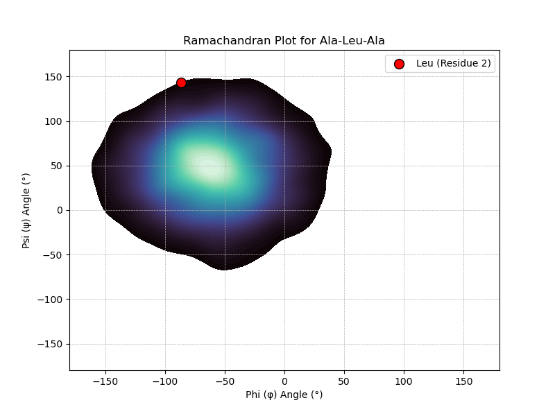

# Problem Statement
Design a tripeptide model (Ala-X-Ala, where X is any amino acid of your choice). Analyze the phi (φ) and psi (ψ) backbone dihedral angles, focusing on steric clashes. Construct a Ramachandran plot to visualize its stable and unstable conformational space.

# Solution

## Getting the desired tripeptide:
- We first went to the CHEBI database and searched for any existing tripeptides.
- We found an full list of tripeptides and in that list we searched for the ones which were in the Ala-X-Ala format.
- We finally found one that matched the format and it was Ala-Leu-Ala.
- So the "X" amino acid is Leucine.
- Link for [Ala-Leu-Ala](https://pubchem.ncbi.nlm.nih.gov/compound/7016119)
- We then downloaded the SDF file of it's structure and projected it in PyMOL.
- We then visualised the structure using PyMOL: 
- We also visualised it using ChimeraX and found the 

Some features of this tripeptide:
- Formula: C12H23N3O4
- Net Charge: 0
- Average Mass: 273.333
- Monoisotopic Mass: 273.16886
- Chemical Roles: Bronsted Base
- IUPAC Name: L-alanyl-L-leucyl-L-alanine

## Calculating the phi (φ) and psi (ψ) backbone dihedral angles & Plotting the Ramachandran Plot of the Tripeptide
Now we find the angles of the tripeptide in Chimera X using the commands:
- torsion :1@C :2@N :2@CA :2@C
- torsion :2@N :2@CA :2@C :3@N

We get the following results:
- Torsion angle for atoms /A ALA 1 C LEU 2 N LEU 2 CA C is -86.4526°
- Torsion angle for atoms /A LEU 2 N LEU 2 CA C ALA 3 N is 143.018°

We then plotted the values in the Ramachandran Plot: 

## Conclusion
From the above, we can conclude that the tripeptide Ala-Leu-Ala has a Antiparallel beta sheet structure.
